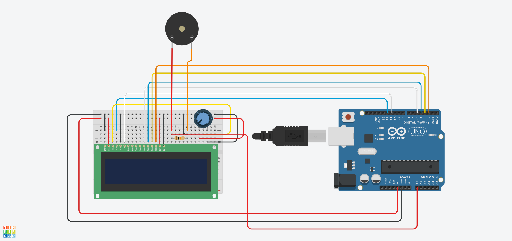

<h1 align="center">MARBLE MAZE LABYRINTH</h1>

<h2>Membros do Grupo</h2>

João Pedro Camargo Batista

João Pedro de Oliveira Nascente

Pedro Antônio Rosa de Souza

Roger Leonardo Coimbra Silva

<h2>Resumo</h2>

O game em questão consiste em uma plataforma 
suspensa que é controlada por um joystick, movendo-se de acordo com o 
manuseio do jogador. O objetivo é levar a bolinha de gude até o final do labirinto 
sem cair nos buracos do caminho, havendo 3 chances.

<h2>Descrição Detalhada</h2>

O Marble Maze Labyrinth é um jogo no qual o jogador 
deve levar uma bolinha de gude até o final do labirinto sem deixar que ela caia 
nos buracos do caminho, desviando dos mesmos e das paredes do jogo.

Para isso, o jogador conta com um joystick, que pode ser movido em várias 
direções e em diferentes eixos. Com o movimento do joystick, dois servo motores 
giram as bases do labirinto (feitas com MDF), fazendo com 
que a plataforma se mova e a bolinha ande pelo percurso.

O percurso conta com paredes e buracos. Se a bolinha cair em um desses 
buracos, o jogador deve colocá-la de volta no início do percurso e recomeçar.

Esse jogo foi proposto pela primeira vez em 1946 pela empresa sueca BRIO. O 
protótipo do jogo ficaria semelhante a este:

Fonte: https://create.arduino.cc/projecthub/AhmedAzouz/arduino-marble-maze-labyrinth-bd9ea6

Fonte: https://create.arduino.cc/projecthub/AhmedAzouz/arduino-marble-maze-labyrinth-bd9ea6

Nós propomos que cada jogador tenha três vidas. Quando as três vidas forem 
perdidas e o jogo for encerrado sem sucesso, o joystick irá parar de funcionar e 
será preciso reiniciar o jogo.

<h2>Lista de Itens Necessários</h2>

2 Arduinos

2 Protoboards

Jumpers

2 Servo Motores

1 Módulo Joystick para Arduino

Papelão e LEGO para a montagem da base

1 Display LCD

1 Cápsula piezoelétrica

<h2>Esquemáticos do Circuito</h2>

Fonte: https://create.arduino.cc/projecthub/AhmedAzouz/arduino-marble-maze-labyrinth-bd9ea6

Esse é o esquemático de ligação do joystick para controlar os dois servo motores 
que movem a plataforma:

Esse é o esquemático de ligação do display LCD com o Arduino UNO e o sensor piezoelétrico.

Um único Arduino não será capaz de manter funcionando os dois servo motores 
e o display LCD, por isso propomos usar um Arduino UNO para controlar os 
motores por meio do joystick e outro para controlar o display LCD.

A alimentação do circuito também deverá ser feita a parte, por pilha

